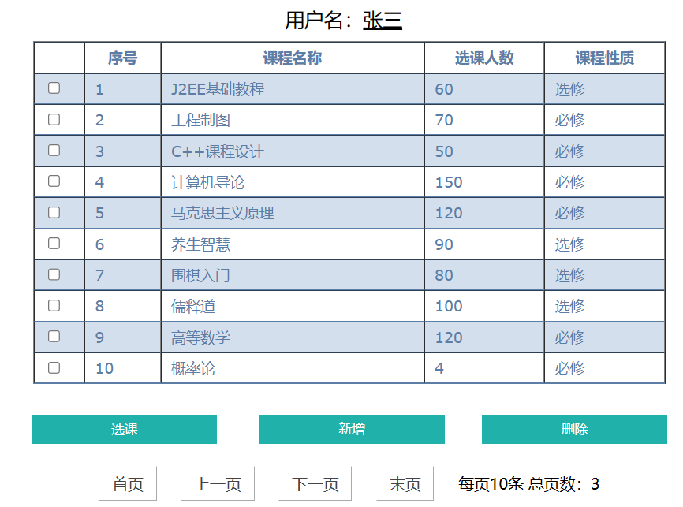
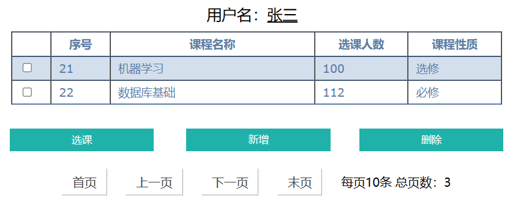

# J2EE_courseManagement

#### 介绍
基于J2ee构建的课程管理系统

#### 软件架构
MyEclipse 2014及以上
Java EE6 - Web 3.0及以上
Java 1.7及以上
JSTL 1.2.1及以上
Tomcat v8.0及以上

#### 主要功能

进入登录界面输入正确的信息并点击登录。

跳转到登陆成功界面5秒后跳转到hitCourse界面。

点击课程管理进入allcourse界面，该界面有分页功能。

新增课程

选课功能

退选、删除功能……